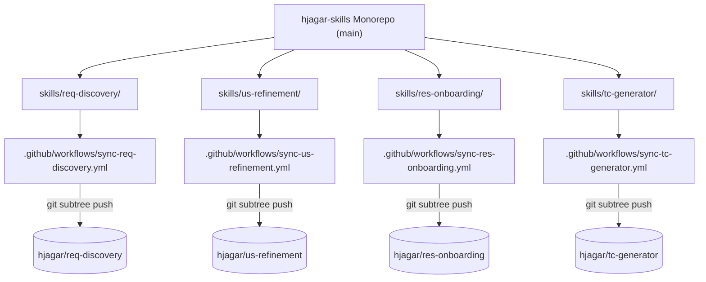

# hjagar-skills

> **Monorepo of agentic engineering skills with multi-agent CLI distribution & automated CI subtree synchronization.**

---

## 🌐 Table of Contents / Tabla de Contenidos

- [English Documentation](#english)
  - [Included Skills](#included-skills)
  - [Supported AI Agents](#supported-ai-agents)
  - [Installation & Usage](#installation--usage)
  - [Monorepo Architecture & CI Sync](#monorepo-architecture--ci-sync)
  - [Release Management](#release-management)
  - [License](#license)
- [Documentación en Español](#español)
  - [Skills Incluidas](#skills-incluidas)
  - [Agentes de IA Soportados](#agentes-de-ia-soportados)
  - [Instalación y Uso](#instalación-y-uso)
  - [Arquitectura Monorepo y Sincronización CI](#arquitectura-monorepo-y-sincronización-ci)
  - [Gestión de Releases](#gestión-de-releases)
  - [Licencia](#licencia)

---

<a name="english"></a>
# English Documentation

Welcome to `hjagar-skills`, the central monorepo for production-grade agentic engineering skills. This repository contains AI skills for requirement discovery, story refinement, developer onboarding, and QA test case generation, alongside CLI tooling to install, update, and release skills across multiple AI coding assistants.

---

## 🚀 Included Skills

| Skill Name | Description | Mirror Repository |
| :--- | :--- | :--- |
| **`req-discovery`** | Extracts structured requirement candidates and user stories from raw conversation transcripts or meeting notes. | [`hjagar/req-discovery`](https://github.com/hjagar/req-discovery) |
| **`us-refinement`** | Refines raw user stories into INVEST-compliant specifications with Gherkin (`Given/When/Then`) acceptance criteria. | [`hjagar/us-refinement`](https://github.com/hjagar/us-refinement) |
| **`res-onboarding`** | Onboards developers (junior/senior) into codebases with custom architecture guides, stack overviews, and setup instructions. | [`hjagar/res-onboarding`](https://github.com/hjagar/res-onboarding) |
| **`tc-generator`** | Generates unit test guidance and QA manual test checklists covering happy paths, edge cases, and failure modes. | [`hjagar/tc-generator`](https://github.com/hjagar/tc-generator) |

---

## 🤖 Supported AI Agents

The installer automatically detects and deploys skills to all configured agent environments on your system:

- **Google Gemini CLI / Antigravity (`~/.gemini/skills/`)**
- **Claude Code (`~/.claude/skills/` & `~/.claude-*/skills/`)**
- **Cursor (`~/.cursor/skills/`)**
- **GitHub Copilot (`~/.copilot/skills/`)**
- **Kiro AI (`~/.kiro/steering/`)**
- **OpenCode (`~/.config/opencode/skills/`)**
- **Generic Agent Directory (`~/.agents/skills/`)**

---

## 💻 Installation & Usage

### 1. Installation

Install a specific skill or all available skills across your AI agent environments:

#### **Linux / macOS (Bash)**
```bash
# Install a specific skill (e.g., us-refinement)
curl -fsSL https://raw.githubusercontent.com/hjagar/hjagar-skills/main/cli/install.sh | bash -s -- --skill us-refinement

# Install all skills in the monorepo
curl -fsSL https://raw.githubusercontent.com/hjagar/hjagar-skills/main/cli/install.sh | bash -s -- --all
```

#### **Windows (PowerShell)**
```powershell
# Install a specific skill
irm https://raw.githubusercontent.com/hjagar/hjagar-skills/main/cli/install.ps1 | iex -Skill us-refinement

# Install all skills
irm https://raw.githubusercontent.com/hjagar/hjagar-skills/main/cli/install.ps1 | iex -All
```

### 2. Updating Skills

Keep installed skills synchronized with the latest releases:

#### **Bash**
```bash
./cli/update.sh --skill us-refinement
./cli/update.sh --all
```

#### **PowerShell**
```powershell
.\cli\update.ps1 -Skill us-refinement
.\cli\update.ps1 -All
```

---

## 🏗️ Monorepo Architecture & CI Sync

This monorepo follows a clean separation between **development/maintenance** and **distribution/consumption**:



- **Single Source of Truth**: All source code, quality gates, and CLI tooling live in `hjagar-skills`.
- **Automated CI Subtree Mirroring**: Each skill folder under `skills/<name>/` is automatically pushed to its dedicated GitHub mirror repo (`hjagar/<name>`) upon merges to `main` via `git subtree push`.

---

## 📦 Release Management

To quality-gate, version-bump, package, and create a GitHub release for a specific skill:

#### **Bash**
```bash
./cli/Release-Repo.sh patch --skill us-refinement
```

#### **PowerShell**
```powershell
.\cli\Release-Repo.ps1 -ReleaseType minor -Skill req-discovery
```

1. Runs quality gate validators (`validation.json` & fixtures) or graceful non-blocking warnings for doc-only skills.
2. Bumps `metadata.version` in `skills/<skill>/SKILL.md`.
3. Packages `build/<skill>.zip`.
4. Creates Git tag `<skill>-vX.Y.Z` and publishes GitHub release via `gh`.

---

<a name="español"></a>
# Documentación en Español

Bienvenido a `hjagar-skills`, el monorepositorio centralizado de skills de ingeniería para agentes de inteligencia artificial. Este repositorio contiene skills para descubrimiento de requerimientos, refinamiento de historias de usuario, onboarding de desarrolladores y generación de casos de prueba QA, junto con herramientas CLI para instalar, actualizar y liberar releases en múltiples asistentes de código.

---

## 🚀 Skills Incluidas

| Nombre de Skill | Descripción | Repositorio Espejo |
| :--- | :--- | :--- |
| **`req-discovery`** | Extrae requerimientos candidatos e historias de usuario desde transcripciones de reuniones o notas brutas. | [`hjagar/req-discovery`](https://github.com/hjagar/req-discovery) |
| **`us-refinement`** | Refina historias de usuario a especificaciones bajo el criterio INVEST con criterios de aceptación Gherkin (`Dado/Cuando/Entonces`). | [`hjagar/us-refinement`](https://github.com/hjagar/us-refinement) |
| **`res-onboarding`** | Realiza el onboarding de desarrolladores (junior/senior) en codebases con guías de arquitectura, tecnologías y configuración. | [`hjagar/res-onboarding`](https://github.com/hjagar/res-onboarding) |
| **`tc-generator`** | Genera guías de tests unitarios y checklists manuales de QA cubriendo camino feliz, casos de borde y errores. | [`hjagar/tc-generator`](https://github.com/hjagar/tc-generator) |

---

## 🤖 Agentes de IA Soportados

El instalador detecta y despliega automáticamente las skills en todos los entornos de agentes configurados en el sistema:

- **Google Gemini CLI / Antigravity (`~/.gemini/skills/`)**
- **Claude Code (`~/.claude/skills/` y `~/.claude-*/skills/`)**
- **Cursor (`~/.cursor/skills/`)**
- **GitHub Copilot (`~/.copilot/skills/`)**
- **Kiro AI (`~/.kiro/steering/`)**
- **OpenCode (`~/.config/opencode/skills/`)**
- **Directorio de Agentes Genérico (`~/.agents/skills/`)**

---

## 💻 Instalación y Uso

### 1. Instalación

Instalá una skill específica o todas las disponibles en tu sistema:

#### **Linux / macOS (Bash)**
```bash
# Instalar una skill específica (ej. us-refinement)
curl -fsSL https://raw.githubusercontent.com/hjagar/hjagar-skills/main/cli/install.sh | bash -s -- --skill us-refinement

# Instalar todas las skills del monorepo
curl -fsSL https://raw.githubusercontent.com/hjagar/hjagar-skills/main/cli/install.sh | bash -s -- --all
```

#### **Windows (PowerShell)**
```powershell
# Instalar una skill específica
irm https://raw.githubusercontent.com/hjagar/hjagar-skills/main/cli/install.ps1 | iex -Skill us-refinement

# Instalar todas las skills
irm https://raw.githubusercontent.com/hjagar/hjagar-skills/main/cli/install.ps1 | iex -All
```

### 2. Actualización

Mantené las skills instaladas al día con las últimas versiones:

#### **Bash**
```bash
./cli/update.sh --skill us-refinement
./cli/update.sh --all
```

#### **PowerShell**
```powershell
.\cli\update.ps1 -Skill us-refinement
.\cli\update.ps1 -All
```

---

## 🏗️ Arquitectura Monorepo y Sincronización CI

El proyecto mantiene una separación clara entre **desarrollo/mantenimiento** y **distribución/consumo**:

- **Única Fuente de Verdad**: Todo el código fuente, validadores de calidad y herramientas CLI viven en `hjagar-skills`.
- **Espejado Automático por CI Subtree**: Cada carpeta bajo `skills/<nombre>/` se sincroniza automáticamente hacia su repositorio espejo en GitHub (`hjagar/<nombre>`) al hacer merge en `main` mediante `git subtree push`.

---

## 📦 Gestión de Releases

Para validar calidad, incrementar versión, empaquetar y publicar un release en GitHub para una skill:

#### **Bash**
```bash
./cli/Release-Repo.sh patch --skill us-refinement
```

#### **PowerShell**
```powershell
.\cli\Release-Repo.ps1 -ReleaseType minor -Skill req-discovery
```

---

<a name="license"></a>
<a name="licencia"></a>
## 📜 License / Licencia

Distributed under the MIT License. See [`LICENSE`](LICENSE) for more details.

Distribuido bajo la Licencia MIT. Ver [`LICENSE`](LICENSE) para más detalles.
