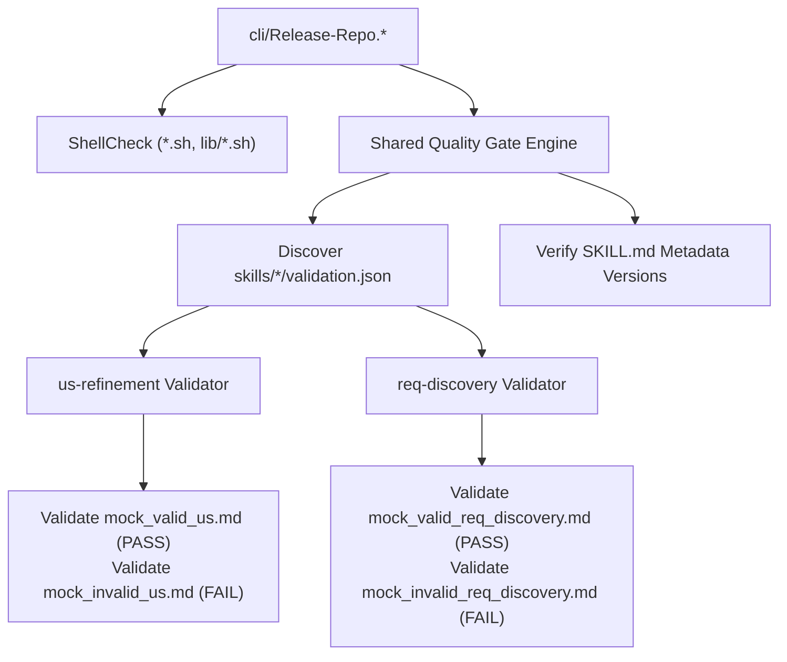

# Technical Design: US1 req-discovery Quality Parity & Shared Quality Gate

## Architecture Overview
This design establishes a shared, declarative quality gate framework in `hjagar-skills`. It replaces legacy single-skill release validation with a modular discovery engine that executes output contract validation across participating skills (`us-refinement` and `req-discovery`), enforcing strict pre-release quality parity.



## Declarative Quality Gate Schema
To guarantee portability and security without executing arbitrary shell scripts, each participating skill declares its validation suite using a `validation.json` manifest:

```json
{
  "skill": "req-discovery",
  "validator": "scripts/validate_req_discovery.py",
  "fixtures": {
    "valid": ["tests/mock_valid_req_discovery.md"],
    "invalid": ["tests/mock_invalid_req_discovery.md"]
  }
}
```

- **Safety Constraint**: The quality gate runner executes python validators via rigid subprocess calls (`python3 <skill_dir>/<validator> <fixture_path>`) with sanitized file paths, strictly disallowing arbitrary shell commands or code execution.

## Validator Implementation (`validate_req_discovery.py`)
The Python validator for `req-discovery` verifies output contract compliance for candidate requirements and zero-candidate responses.

### Rule Suite
1. **Zero-Candidate Validation**: When zero signals exist, exact text `"No candidate requirements were found in this transcript."` (or transcript language equivalent) is validated.
2. **Candidate Requirement Block Validation**:
   - **Title**: Must begin with header `### <title>`.
   - **User Story**: Must contain `**Story:** As a ..., I want ..., so that ...` pattern.
   - **Context**: Must contain `**Context:** <paraphrase, speaker, timestamp if known>`.
   - **Resolution**: Must contain `**Resolution:** <note if topic revisited>`.
   - **Confidence**: Must specify `**Confidence:** explicit` or `implied`.
   - **Possible Match**: Optional `**Possible match:**` header validated if present.
   - **Hidden Recap**: Must append `<!-- en-summary: <English prose recap> -->` for candidate blocks.
3. **Language Matching**: Rejects missing required block keys or structural deformities.

## Shared Execution Engine & Release Integration
- **Shared Gate Engine (`cli/lib/quality-gate.*` / release script integration)**:
  1. Finds all `skills/*/validation.json` declarations in participating skills.
  2. Runs declared validators against `valid` fixtures (asserting exit code 0) and `invalid` fixtures (asserting non-zero exit code).
  3. Halts release execution with non-zero exit status immediately upon any validation failure.
- **`us-refinement` Integration**: Configures `skills/us-refinement/validation.json` pointing to `validate_refinement.py` and existing fixtures, preserving 100% pass/fail parity.
- **Version Management**: Updates `skills/req-discovery/SKILL.md` frontmatter `metadata.version` to `1.1.0`. `cli/Release-Repo.*` verifies version compliance before release packaging.

## Security & Threat Matrix

| Threat | Impact | Mitigation Strategy |
| :--- | :--- | :--- |
| **Arbitrary Shell Execution** | High | Declarative JSON configuration restricts execution to Python validator scripts; no `eval` or shell interpretation. |
| **Path Traversal in Fixture Declarations** | Medium | Quality gate normalizes paths relative to skill directory and enforces containment within `skills/`. |
| **False-Positive Version Mismatches** | Low | Version check parses YAML frontmatter explicitly, ignoring body comments. |
| **Dirty Working Tree / Untracked Changes** | Medium | Pre-flight safety checks enforce clean main branch state before running quality gate. |

## Verification Plan
1. **Unit Verification**: Run `validate_req_discovery.py` directly against valid and invalid test fixtures.
2. **Quality Gate Verification**: Execute shared quality gate across `us-refinement` and `req-discovery`.
3. **Release Script Verification**: Test `cli/Release-Repo.sh` and `cli/Release-Repo.ps1` in dry-run mode to confirm failure aborts and release packaging logic.
